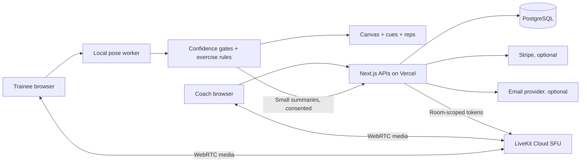

# Fuzzfit — research and implementation plan

Prepared 6 October 2026. Hosting decision: Vercel + LiveKit Cloud. This is a technical plan, with proposed targets clearly distinguished from measured results. The launch checklist is a release gate, not a claim of certification.

## 1. Product definition

Build an online studio where a coach supervises several invited trainees in one live session. Each trainee runs camera-based pose estimation locally. The coach sees video, current exercise, reps, tracking confidence, estimated movement quality, and prioritized coaching requests. Trainees get short correction cues and can always request human assistance. Preserve the coach's authority and present measurement uncertainty explicitly.

Zing's first-party description confirms camera-based movement assessment and progress-oriented fitness testing; it does not disclose a reproducible scoring algorithm, validated error rates, or its complete architecture. We will implement an independently designed system, not claim parity or copy proprietary analytics. [Zing fitness test](https://www.zing.coach/fitness-library/fitness-test-feature-spotlight).

### Users and journeys

- Coach: sign up, establish a studio, invite a client, create a workout, schedule a class, open the studio, inspect participants, change the exercise, pause/resume, send individual corrections, end the session, review history.
- Trainee: sign up, accept a studio invitation, see scheduled sessions and assigned plans, join a live room, consent to sharing, position the camera, train with local feedback, pause or ask for help, inspect their own history.
- Operator: configure services, manage verified coaches and abuse reports, reconcile billing, monitor errors, respond to privacy requests, restore data, roll back releases. A separate operator console is a later milestone.

Initial assumptions: adults only; general wellness and bodyweight/basic resistance movements; coach-led sessions; no rehabilitation, injury diagnosis, estimated body fat, medical recommendations, or camera-derived heart rate. Support 1 coach and up to 8 trainees per session initially, then measure before increasing the cap. A larger cap is a product decision informed by attention as well as network capacity.

## 2. Requirement map and acceptance criteria

| Area | Initial implementation | Acceptance |
| --- | --- | --- |
| Identity | Better Auth email/password, database sessions, role setup | Protected routes and APIs reject anonymous callers; role supplied by a client cannot change an existing role |
| Studio ownership | Owned studio, client invite codes, membership | Coach A cannot read or mutate Coach B's clients, sessions, messages, or analytics |
| Scheduling | Timezone-aware session creation, capacity, roster | Store UTC; display local times; validate duration, participants, and ownership; one status transition wins |
| Workouts | Catalog, editable plans, sets/reps/rest | Validated exercise IDs and bounded numbers; durable server records |
| Live coaching | LiveKit video/audio, roster, session controls, targeted text cues | Access token scoped to member, room, allowed sources, and short expiration; completed rooms reject new joins |
| Camera analysis | MediaPipe worker, skeleton, tracking gates, movement state machine | No camera before explicit action; no score on missing/ambiguous pose; close tracks on teardown |
| Feedback | Short deterministic cues, score estimate, rep counter | Confidence and phase accompany output; stable thresholds/cooldown; no diagnosis or claims of perfection |
| History | Per-session summaries and progress | Authenticated individual data; coach sees only studio clients; sample data visibly separate |
| Communication | Session messages and individual coach cues | Sender determined by session cookie, recipient authorized; no arbitrary sender or session IDs |
| Settings | Profile, privacy preferences, data export | Updates validated; export excludes another person's private data |
| Commercial | Stripe checkout, portal, signed webhook | Disabled honestly when unconfigured; no payment-card storage; replay-safe event processing |
| Operations | Health, tests, migrations, release docs | Production build passes; secrets stay server-side; production rejects development storage/config |

Premium experience means reliable feedback, clear camera setup, intentional empty/loading/error states, keyboard access, usable mobile training controls, and a quiet interface. It does not mean fabricated live participants, invented calories, fake AI chat, or purchase buttons that silently succeed.

## 3. Architecture and alternatives

Use Next.js App Router, React, TypeScript, CSS design tokens, Prisma, PostgreSQL, Better Auth, LiveKit's browser/server SDKs, Zod validation, Vitest, and browser/API integration tests. Local SQLite supports a no-service developer preview; a separate synchronized PostgreSQL schema and migrations are used on Vercel. SQLite must never be used as Vercel production storage.

Why this split: browser inference avoids uploading camera frames for AI and scales with trainees' devices. SFU video avoids a mesh's rapidly growing upload burden. Vercel handles web APIs and assets rather than long-lived media sockets. PostgreSQL provides durable relationships and transactions. These are design inferences, supported by [Vercel storage guidance](https://vercel.com/docs/storage) and [LiveKit tracks](https://docs.livekit.io/intro/basics/rooms-participants-tracks/tracks/).

Alternatives: MoveNet offers a lean landmark set but less detail for the chosen body landmarks; server GPU inference gives centralized control but adds video transfer, privacy exposure, and cost; peer-to-peer mesh is simpler for two people but less attractive for group classes; a native mobile app can offer tighter camera and hardware control but adds a second delivery surface. Choose MediaPipe and browser delivery for the initial vertical slice; benchmark on actual low-end devices before widening support.

## 4. Pose estimation pipeline

Google's task returns normalized and inferred world landmarks, including visibility; the model identifies 33 body points. Its video calls are synchronous, so run them in a Web Worker. These outputs are inferred estimates, not motion-capture ground truth. [MediaPipe guide](https://developers.google.com/edge/mediapipe/solutions/vision/pose_landmarker/web_js); [BlazePose paper](https://arxiv.org/abs/2006.10204).

1. Ask for camera access through a visible button. Explain local analysis, live-video sharing, and summary sharing separately. No recording by default.
2. Use a side-on camera for the initial angle-based exercises; require the relevant shoulder/hip/knee/ankle or shoulder/elbow/wrist in frame. Show position, lighting, distance, and obstruction guidance.
3. Load pinned WASM/model assets, lazy-load the worker, use one in-flight frame, transfer ImageBitmap, close each bitmap, and cap inference cadence. Skip frames instead of queuing stale frames.
4. Detect up to two people and refuse scoring when more than one body is present. This is a single-trainee estimator, not multi-person exercise attribution.
5. Gate on required landmark visibility, finite coordinates, frame boundaries, orientation, and nondegenerate bone geometry. Select a consistent visible body side. Invalidate active reps after tracking loss or a side change.
6. Compute angles in aspect-corrected image coordinates. Do not calculate angles directly from normalized x/y when width and height differ. Use a limited smoothing window; require stable phases and minimum rep duration.
7. Use an exercise-specific finite state machine: established start → stable working phase → return to start → count. Starting mid-rep or briefly crossing a threshold must not count.
8. Expose estimated score, tracking confidence, phase, cues, and reps independently. A missing estimate is null, never a zero that implies poor performance.
9. Send bounded summaries at low frequency to the authenticated backend, with server timestamps and exercise revision. Reject stale exercise revisions so delayed frames cannot replace current analysis.
10. Pause invalidates in-progress reps. Stop closes tracks and terminates the worker. Model failures preserve a usable coach/video interface and show retry guidance.

Initial detectors: squat (knee angle and trunk cue), push-up (elbow phase and approximate shoulder/hip/ankle alignment), biceps curl (elbow phase and upper-arm movement cue), plank (approximate body alignment, hold duration). Rules are deliberately limited. Single-camera 2D geometry cannot reliably prove joint loading, spinal curvature, knee rotation, symmetric weight distribution, depth outside the camera plane, or injury risk. Do not generate cues about unmeasured properties.

### Scoring and feedback policy

Use transparent bounded heuristic estimates, not an unspecified prediction model. Score only after usable observation; publish rule version and avoid comparing scores from different versions without marking the change. Different phases have different acceptable geometry: a squat standing phase must not be penalized for lacking squat depth. Form estimate is not calorie burn, strength, fitness age, diagnosis, or probability of injury. High scores mean the observed landmarks match the limited rule criteria.

Coach cues take priority and show their source. Limit automated cue cadence; prefer one actionable cue and a short explanation over several simultaneous corrections. A user can mute voice cues, stop tracking, and request help. Voice uses optional browser speech synthesis and is disabled by default.

Later validation: independently annotated consenting videos spanning body types, skin tones, clothing, light, camera placements, devices, exercise variations, fatigue, and mobility limitations; double-rated by qualified coaches; participant-level train/validation/test separation if a learned scoring model is introduced; report precision/recall for cues, rep count error, tracking uptime, subgroup metrics, and rejection rates. Proposed gates: rep count error ≤1 per 20-rep supported set, cue precision ≥90%, false reassurance <5% on rated faults. These are proposed targets, not measured claims. Thresholds and exercise inclusion must be revised from evidence.

## 5. Real-time coaching design

Use one LiveKit room per scheduled session. Issue tokens only after authentication, membership, and room-state checks. JWT identity is the database user ID; room names come from server records. Restrict publishing to camera/microphone and avoid admin grants to clients. [LiveKit tokens](https://docs.livekit.io/frontends/reference/tokens-grants/).

Coach grid uses adaptive stream and dynacast; larger focused video receives a better layer. Keep corrections and analytics on member-authorized API channels; do not broadcast private details in room metadata. Class participants explicitly consent to group visibility in the initial release; private trainee-to-coach-only media requires enforced SFU subscription permissions and separate testing before it can be promised. [Adaptive subscriptions](https://docs.livekit.io/guides/room/receive); [track permissions](https://docs.livekit.io/transport/media/publish/).

Do not reuse a second independent camera stream unnecessarily: analyze the published local camera track when connected. Provide microphone mute, camera on/off, reconnection feedback, an elapsed timer, help request, and exit. Ending a class updates the authoritative database state and deletes the LiveKit room; clients observing terminal state disconnect. Grant lifetime alone does not revoke an existing connection.

Initial summaries/control use bounded polling with backoff, because this fits Vercel without a custom persistent socket service. Local cues remain immediate. This is an explicit scalability tradeoff: 8 trainees sending every 3 seconds over 45 minutes create ~7,200 writes; 1 coach polling every 3 seconds adds ~900 reads. At larger scale move live metrics to a managed realtime channel with authenticated topics and store only rep/set events plus periodic snapshots. Do not persist 30–60 FPS landmark streams.

LiveKit Cloud refreshes connected participants' tokens; a short initial expiration alone cannot enforce class completion. Disable automatic room creation, create rooms explicitly on class start, and remove all authorized identities with an explicit revocation cutoff before deleting the room. Validate cached/refreshed-token rejoin attempts in Cloud. The pinned SDK supports `revokeTokenTs`; these calls are implemented but their external behavior still needs real-project tests. [Current token lifecycle](https://docs.livekit.io/frontends/reference/tokens-grants/); [participant management](https://docs.livekit.io/intro/basics/rooms-participants-tracks/participants/).

## 6. Data model and consistency

Auth: User, Account, Session, Verification, RateLimit. Domain: Studio (owner); Membership (studio/user unique); Invitation (hash, expiry, consumed state); WorkoutPlan (owned studio, validated block JSON); ClassSession (studio, schedule, capacity, status, exercise/revision); Enrollment (session/user unique); Metric (enrollment unique latest summary); WorkoutSummary (session/user unique); Message (session, sender, optional recipient); BillingSubscription; WebhookEvent; AuditEvent.

Store dates in UTC, show the viewer's timezone. Stable IDs do not grant access. Scope every query to identity and membership. Coach ownership is checked on mutation, trainee writes bind to their enrollment. Use transactions for invite redemption, capacity enrollment, lifecycle transitions, and webhook processing. Use compare-and-set guards to avoid race conditions. Server determines timestamps, sender, coach, room name, and billing ownership.

No raw frames are stored. Persist limited summary fields and consent preferences. Latest metrics are replaced rather than appended indefinitely. Export includes only the requesting person's profile, memberships, attendance, and workout results. Retention and deletion must be configured and verified before accepting real customer data.

## 7. Authentication and application security

Use Better Auth rather than create a password/session protocol. Configure trusted origins, HTTP-only secure production cookies, password bounds, database rate limiting, session expiry, and verification/reset hooks through an email provider. Role setup is server-side and one-time; later role changes are not allowed through a general profile update. Page-level guards are insufficient: authorize every route handler too. [Better Auth Next.js](https://better-auth.com/docs/integrations/next); [database schema](https://better-auth.com/docs/concepts/database); [Next.js auth guidance](https://nextjs.org/docs/app/guides/authentication).

All mutations require trusted Origin, JSON content type, request body size bounds, Zod schemas, and per-user rate limits. Errors expose safe user messages and request IDs, not secrets or stacks. Add secure headers and a CSP compatible with camera, WebRTC, WASM workers, and the selected LiveKit endpoint. Do not put secrets in NEXT_PUBLIC variables. Validate production configuration and prevent auto-created demo identities or seed execution on deployment. Review against [OWASP ASVS](https://owasp.org/projects/asvs) before launch; passing local tests is not an independent security audit.

## 8. Privacy and wellbeing

Require adult confirmation, a plain-language preflight, sharing consent, and an accessible stop button. Stop on pain and refer to a qualified professional where needed; the product is general fitness assistance. No video recording, uploads, emotion recognition, identity recognition, or advertising use of pose data in this scope. Standard WebRTC transport encryption is not a claim of end-to-end encryption; E2EE needs a separate key-distribution design and conflicts with server recording/inspection. [LiveKit encryption](https://docs.livekit.io/transport/encryption/).

Camera access needs a secure context and explicit browser permission. Treat denied permission, occupied camera, unsupported APIs, and missing devices as normal product states. [MDN getUserMedia](https://developer.mozilla.org/en-US/docs/Web/API/MediaDevices/getUserMedia).

Before launch choose markets, retention periods, legal entity, vendor regions, data-processing agreements, cross-border transfer basis, breach procedures, and privacy-request contacts with qualified counsel. GDPR has an EU framework; India requires a separate applicability and commencement assessment under the DPDP framework. Do not claim compliance from implementing a consent checkbox. [European Commission](https://commission.europa.eu/law/law-topic/data-protection/legal-framework-eu-data-protection_en); [MeitY framework](https://www.meity.gov.in/data-protection-framework).

## 9. Interface and accessibility

Design direction: calm ivory canvas, dark ink, electric lime, lavender analytics, generous spacing, compact navigation, editorial typography. Main coach dashboard prioritizes the next session and client attention. Live studio places participants first; analytics support intervention. Trainee mode has large camera controls and one cue at a time. Mobile gets a compact navigation bar and stacked camera/feedback.

Keyboard-visible focus, labelled controls, semantic forms, error announcements, reduced motion, readable contrast, non-color status labels, and targets of at least 44px where practical. Test keyboard navigation and mobile layout. WCAG 2.2 adds focus-not-obscured and target size criteria; automated tests alone do not establish conformance. [W3C WCAG update](https://www.w3.org/WAI/standards-guidelines/wcag/new-in-22/).

## 10. Commercial and supporting functions

Implement opt-in Stripe subscriptions with server-selected prices, authenticated checkout/portal, signed raw-body webhooks, durable event IDs, and reconciliation with current subscription state. Never grant access based on a success URL. Leave the service disabled visibly until configured. Commercial packaging and paid entitlement limits need business confirmation before billing is enabled. [Stripe webhooks](https://docs.stripe.com/webhooks); [idempotency](https://docs.stripe.com/api/idempotent_requests).

Launch essentials beyond the workout: client roster, invite acceptance, session schedule, workout plans, session messages, human coaching cues, progress history, profile/settings, privacy explanation, account data export, usable empty states, documented setup and operations.

Future premium milestones: verified coach onboarding, organization roles, recurring availability and booking/payment cancellation policies, push/email reminders, reviewed exercise video library, richer personalized plan assignment, progressive overload, offline notes, nutrition journals without medical claims, wearable integrations, localized content, consented recordings, native apps, and operator console. Avoid claiming these are implemented until they are delivered and verified.

## 11. Delivery order

1. Research and this plan; define defaults and launch constraints.
2. Scaffold typed Next.js app; establish database/auth/access layer and sample-only preview.
3. Build dashboard, clients, schedules, plan editor, and history with durable APIs.
4. Build class lifecycle, LiveKit grants/connection, roster, cues, help and messages.
5. Implement worker inference, overlays, conservative rules, rep state machines, consent and cleanup.
6. Add settings/export, optional email and billing adapters, health, migrations and Vercel configuration.
7. Run type checks, detector tests, authentication/authorization and API integration tests, browser flows, responsive checks and production build. Record evidence and remaining gaps.
8. Connect actual PostgreSQL, LiveKit, email, and payment test services; rehearse multi-device calls, failure recovery, webhooks and restores; obtain validation and security review before public launch.

## 12. Performance, cost, and operations

Proposed targets: camera inference 10–15 FPS on a supported midrange device, local cue latency <300ms, room entry <5 seconds after grants, API p95 <500ms excluding cold starts. Measure rather than advertise. Mobile thermal throttling and simultaneous WebRTC are critical test cases. Track frame cadence, worker errors, camera denied rate, reconnect frequency, API errors, and database pool saturation without frames or sensitive messages in logs.

Estimate cost from participant-minutes, video layer/egress, function invocations, database writes/storage, email, and payment processing. A 45-minute 9-person class is 405 participant-minutes. Multiply by monthly classes and confirm current provider pricing in the account before approving spend. No hard-coded pricing promises.

Select Vercel function and PostgreSQL regions together, use pooled runtime and direct migration connections, separate preview/test/production databases and secrets, enable PITR/backups, and rehearse restoration. Migrate using expand/contract discipline before promoting a tested deployment. Set budget alerts, on-call ownership, a status page, and service degradation instructions. Retain rollback-compatible schema changes.

## 13. Verification and release gates

- Detector tests: finite/degenerate coordinates, aspect ratio, low confidence, partial frame, multiple persons, side changes, rep thresholds and hysteresis, mid-rep start, tracking loss, pause/reset, bounded score and hold time.
- API tests: anonymous/foreign-coach access, spoofed recipient, invalid exercises, enrollment capacity, expired/reused invites, repeated lifecycle actions, stale metric revisions, request origin, completed room joins, export isolation.
- Browser tests: coach signup/studio, trainee signup/invite, schedule/create/join/end, camera unavailable/retry, sample/live separation, keyboard/mobile layout, messages and summary persistence.
- Service tests with credentials: two physical devices on independent networks, TURN and reconnect, actual video/audio mute/stop, room deletion, signed Stripe duplicate/out-of-order events, delivered reset/verification emails, pooled PostgreSQL load.
- Human gates: exercise cue dataset evaluation, qualified-coach review, accessibility audit, threat model/pentest, legal/privacy review, restore drill and incident rehearsal.

The implementation can be locally functional and deployment-ready without being production-validated. Final reporting must say exactly which checks ran, which services were connected, and which gates remain. All externally dependent tests remain pending until real service credentials and devices are available.
